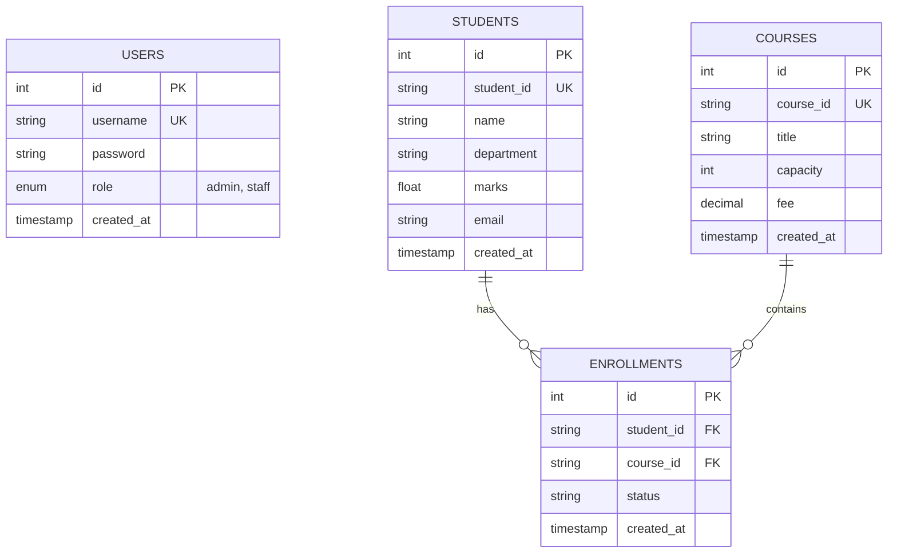

# ER Diagram & Database Schema Specification (Job 02)

## 1. Entity-Relationship Diagram (Mermaid)



## 2. Table Specifications

### 2.1 Table: `users`
Stores system users and their assigned roles for access control.

| Column | Type | Constraints | Description |
| :--- | :--- | :--- | :--- |
| `id` | `INT` | `PRIMARY KEY`, `AUTO_INCREMENT` | Internal user ID |
| `username` | `VARCHAR(50)` | `NOT NULL`, `UNIQUE` | User login name |
| `password` | `VARCHAR(255)` | `NOT NULL` | Bcrypt hashed password |
| `role` | `ENUM('admin', 'staff')` | `NOT NULL`, `DEFAULT 'staff'` | RBAC access role |
| `created_at` | `TIMESTAMP` | `DEFAULT CURRENT_TIMESTAMP` | Record creation timestamp |

### 2.2 Table: `students`
Stores student profile and academic details.

| Column | Type | Constraints | Description |
| :--- | :--- | :--- | :--- |
| `id` | `INT` | `PRIMARY KEY`, `AUTO_INCREMENT` | Internal database ID |
| `student_id` | `VARCHAR(50)` | `NOT NULL`, `UNIQUE` | Unique institutional student ID |
| `name` | `VARCHAR(100)` | `NOT NULL` | Full name of student |
| `department` | `VARCHAR(100)` | `NOT NULL` | Department / Academic stream |
| `marks` | `FLOAT` | `NOT NULL`, `DEFAULT 0` | Academic score / marks |
| `email` | `VARCHAR(100)` | `NOT NULL` | Contact email address |
| `created_at` | `TIMESTAMP` | `DEFAULT CURRENT_TIMESTAMP` | Record creation timestamp |

### 2.3 Table: `courses`
Stores course information and capacity configuration.

| Column | Type | Constraints | Description |
| :--- | :--- | :--- | :--- |
| `id` | `INT` | `PRIMARY KEY`, `AUTO_INCREMENT` | Internal database ID |
| `course_id` | `VARCHAR(50)` | `NOT NULL`, `UNIQUE` | Unique course code |
| `title` | `VARCHAR(150)` | `NOT NULL` | Title / name of course |
| `capacity` | `INT` | `NOT NULL`, `DEFAULT 30` | Maximum student capacity limit |
| `fee` | `DECIMAL(10, 2)` | `NOT NULL`, `DEFAULT 0.00` | Course fee |
| `created_at` | `TIMESTAMP` | `DEFAULT CURRENT_TIMESTAMP` | Record creation timestamp |

### 2.4 Table: `enrollments`
Tracks course enrollments with relational constraints.

| Column | Type | Constraints | Description |
| :--- | :--- | :--- | :--- |
| `id` | `INT` | `PRIMARY KEY`, `AUTO_INCREMENT` | Internal database ID |
| `student_id` | `VARCHAR(50)` | `NOT NULL`, `FOREIGN KEY (students.student_id)` | Reference to student |
| `course_id` | `VARCHAR(50)` | `NOT NULL`, `FOREIGN KEY (courses.course_id)` | Reference to course |
| `status` | `VARCHAR(20)` | `NOT NULL`, `DEFAULT 'enrolled'` | Enrollment status |
| `created_at` | `TIMESTAMP` | `DEFAULT CURRENT_TIMESTAMP` | Record creation timestamp |

> [!IMPORTANT]
> **Composite UNIQUE Constraint**: `CONSTRAINT unique_student_course UNIQUE (student_id, course_id)` guarantees at the database schema level that a student cannot be enrolled in the same course more than once.

## 3. SQL DDL Script (`schema.sql`)

```sql
CREATE DATABASE IF NOT EXISTS student_mgmt_db;
USE student_mgmt_db;

CREATE TABLE IF NOT EXISTS users (
  id INT AUTO_INCREMENT PRIMARY KEY,
  username VARCHAR(50) NOT NULL UNIQUE,
  password VARCHAR(255) NOT NULL,
  role ENUM('admin', 'staff') NOT NULL DEFAULT 'staff',
  created_at TIMESTAMP DEFAULT CURRENT_TIMESTAMP
);

CREATE TABLE IF NOT EXISTS students (
  id INT AUTO_INCREMENT PRIMARY KEY,
  student_id VARCHAR(50) NOT NULL UNIQUE,
  name VARCHAR(100) NOT NULL,
  department VARCHAR(100) NOT NULL,
  marks FLOAT NOT NULL DEFAULT 0,
  email VARCHAR(100) NOT NULL,
  created_at TIMESTAMP DEFAULT CURRENT_TIMESTAMP
);

CREATE TABLE IF NOT EXISTS courses (
  id INT AUTO_INCREMENT PRIMARY KEY,
  course_id VARCHAR(50) NOT NULL UNIQUE,
  title VARCHAR(150) NOT NULL,
  capacity INT NOT NULL DEFAULT 30,
  fee DECIMAL(10, 2) NOT NULL DEFAULT 0.00,
  created_at TIMESTAMP DEFAULT CURRENT_TIMESTAMP
);

CREATE TABLE IF NOT EXISTS enrollments (
  id INT AUTO_INCREMENT PRIMARY KEY,
  student_id VARCHAR(50) NOT NULL,
  course_id VARCHAR(50) NOT NULL,
  status VARCHAR(20) NOT NULL DEFAULT 'enrolled',
  created_at TIMESTAMP DEFAULT CURRENT_TIMESTAMP,
  CONSTRAINT unique_student_course UNIQUE (student_id, course_id),
  FOREIGN KEY (student_id) REFERENCES students(student_id) ON DELETE CASCADE ON UPDATE CASCADE,
  FOREIGN KEY (course_id) REFERENCES courses(course_id) ON DELETE CASCADE ON UPDATE CASCADE
);
```
