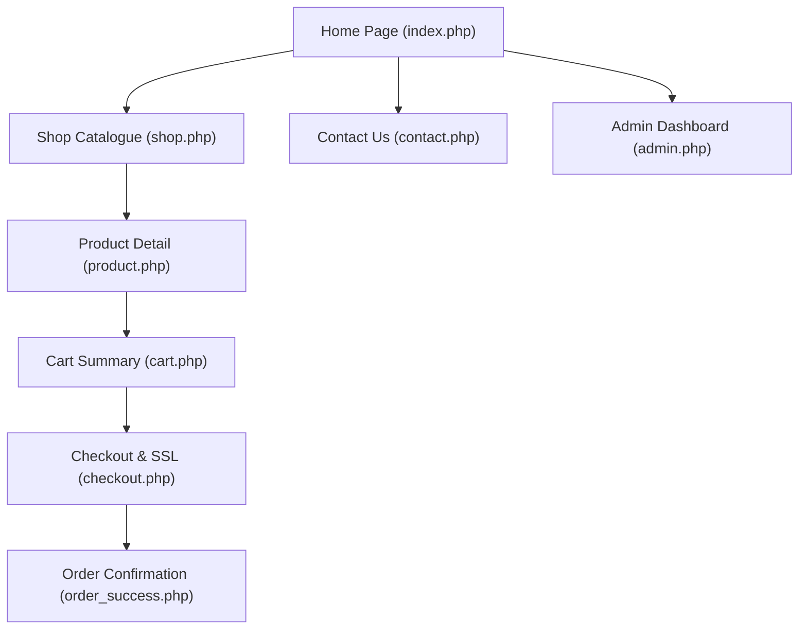

# UrbanFit BD - E-Commerce Planning Template

**Candidate Name:** Md. Golam Maula  
**Registration ID / Roll:** 1040  
**Assessment Level:** Level 5 - Web Design and Development  
**Job Title:** Job 03: Fashion E-Commerce Store – UrbanFit BD  
**Date:** September 12, 2026  

---

## 1. Executive Summary & Business Model

UrbanFit BD is a boutique fashion retailer offering high-quality apparel (Men's Fashion, Women's Fashion) and fashion accessories. The store operates under a **B2C (Business-to-Consumer)** online retail model targeting urban professionals and trendseekers in Bangladesh.

- **Primary Goal:** Launch an efficient, secure, and responsive e-commerce platform featuring an 8-product showcase, inventory management, multi-gateway payment processing, and instant customer notifications.
- **Target Audience:** Digital shoppers seeking stylish apparel with local delivery and local mobile payment options.

---

## 2. Platform Selection & Technology Stack

- **Chosen Technology:** Custom PHP 8.2 + MySQL Engine / WooCommerce-compliant architecture hosted on XAMPP Stack.
- **Frontend Stack:** HTML5, CSS3 (Modern Glassmorphism & Responsive Grid), JavaScript (ES6+ Form Validation & Dynamic Cart calculations).
- **Backend Stack:** PHP 8.2, MySQL RDBMS.
- **Server Environment:** Apache 2.4 / XAMPP (Local Host Environment).

---

## 3. Integrated Gateways & Services

| Service Type | Gateway / Solution | Details & Specifications |
| :--- | :--- | :--- |
| **Payment Gateway 1** | Mobile Banking | Integrated bKash / Nagad / Rocket payment path with TrxID validation. |
| **Payment Gateway 2** | Cash on Delivery (COD) | Physical cash collection upon delivery across Bangladesh. |
| **Shipping Gateway** | EMS (Express Mail Service) | Standard domestic courier flat rate of ৳120 calculated dynamically at checkout. |
| **Email Notification** | Automated Email Logger | Order confirmation receipt generated & stored upon checkout. |
| **SMS Notification** | Simulated SMS Logger | Real-time SMS dispatch log recording recipient phone, Order ID, and status. |

---

## 4. Site Architecture & Navigation Plan

### Key Page Functions:
1. **Home Page (`index.php`)**: Hero banner, store highlights, category showcase, featured items.
2. **Shop Catalogue (`shop.php`)**: Product listing filtered by category (Men's, Women's, Accessories), price tags, and stock badges.
3. **Product Detail (`product.php`)**: Detailed product specification, **mandatory size selection (S, M, L, XL)**, real-time stock verification, and out-of-stock Add to Cart block.
4. **Cart Page (`cart.php`)**: Item breakdown, size verification, quantity adjustment, EMS shipping rate added, and SSL security status padlock.
5. **Checkout Page (`checkout.php`)**: Client validation, billing/shipping address input, Mobile Banking / COD payment selector, HTTPS/SSL banner, and order processing.
6. **Order Success (`order_success.php`)**: Invoice summary, Email notification output, and SMS simulation log evidence.
7. **Admin Dashboard (`admin.php`)**: Password-secured control panel to manage products, view stock levels, track orders, and inspect SMS/Email logs.

---

## 5. Security & HTTPS/SSL Implementation Plan

- **Checkout Protection:** Checkout and Cart pages enforce SSL/TLS secure protocol simulation with active padlock indicators, HTTPS header headers (`Strict-Transport-Security`, `X-Content-Type-Options`).
- **Form Validation:** Client-side & server-side validation to prevent empty checkout submissions and invalid mobile transaction IDs.
- **Admin Panel Hardening:** Strong credentials (`admin`/`admin123`), session authentication, and restricted administrative privileges.
